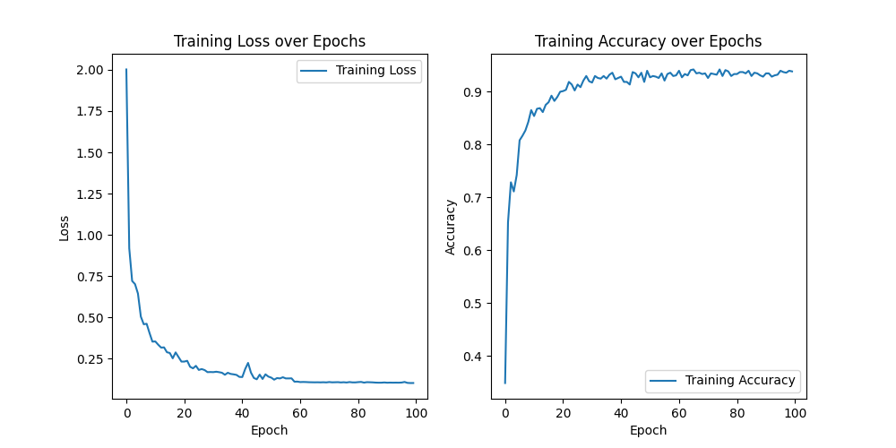

# Audio Data Preparation and CNN Training

This project provides a comprehensive pipeline for preparing and training Convolutional Neural Networks (CNN) on any audio data. The project includes scripts for preprocessing audio files, extracting features, and training a CNN model. It can handle a wide variety of audio datasets, automatically preparing them for effective training

## Features
- **Audio Preprocessing:** Splits audio files into segments and removes silent portions based on a specified decibel threshold.
- **Feature Extraction:** Extracts Mel-Frequency Cepstral Coefficients (MFCC) from audio segments for feature representation.
- **Dataset Creation:** Organizes processed audio data into a format suitable for training neural networks.
- **Training and Testing:** Includes a CNN model definition and functions for training and testing the model (on pytorch).
- **Flexible Configuration:** Parameters such as segment duration, MFCC coefficients, and more can be easily adjusted.

## Usage
1. **Prepare the Audio Data:**

Use the script to preprocess your audio data, extract features, and create a dataset.

```bash
python data_creator.py --dir <input_directory> --out <output_directory> --dlf <decibel_level> --sd <segment_duration> --mfcc <mfcc_coefficients> --asb
```

### in data_creator.py:

Arguments for data_creator.py
- **--dir** - Input directory containing audio files (default: data).
- **--out** - Output directory for the processed dataset (default: dataset test).
- **--seq** - Save segments  (default: False).
- **--dlf** - Maximum decibel level for deletion of silent fragments (default: -40).
- **--sd** - Segment duration in seconds (default: 0.5).
- **--mfcc** - Number of Mel-frequency cepstral coefficients to extract (default: 20).
- **--asb** - Adjust data size for balance (**_Warning: Deletes data to smallest size_**) (default: False).

2. After that, configure config.py and run main.py.

```bash
python main.py
```

## Example

_I have a folder named data with recordings of 6 guitar strings, each string recorded in a separate file:_

- data/string 1 (clean).wav
- data/string 1 (noise).wav
- data/string 2 (clean).wav
- data/string 2 (noise).wav
- ...

1. I run data_creator.py with the following parameters:

python data_creator.py --dir data --out "dataset test" --dlf -40 --sd 0.5 --mfcc 20 --asb

And I get the following result in a table:

```
Dataset structure:
Classes name     | Total of Samples | After removed by db (removed) | Torch files          | Final data size (asb removed) | Mfcc size
string 3 (noise) | 187              | 185 (-2)                      | string 3 (noise).pth |  84 (-101)                   | [20, 22] 
string 5 (clean) | 185              | 182 (-3)                      | string 5 (clean).pth |  84 (-98)                    | [20, 22] 
string 1 (clean) | 184              | 84 (-100)                     | string 1 (clean).pth |  84 (-0)                     | [20, 22] 
string 4 (noise) | 206              | 201 (-5)                      | string 4 (noise).pth |  84 (-117)                   | [20, 22] 
string 2 (clean) | 187              | 154 (-33)                     | string 2 (clean).pth |  84 (-70)                    | [20, 22] 
string 6 (noise) | 141              | 137 (-4)                      | string 6 (noise).pth |  84 (-53)                    | [20, 22] 
string 5 (noise) | 178              | 175 (-3)                      | string 5 (noise).pth |  84 (-91)                    | [20, 22] 
string 3 (clean) | 201              | 147 (-54)                     | string 3 (clean).pth |  84 (-63)                    | [20, 22] 
string 2 (noise) | 187              | 185 (-2)                      | string 2 (noise).pth |  84 (-101)                   | [20, 22] 
string 6 (clean) | 191              | 189 (-2)                      | string 6 (clean).pth |  84 (-105)                   | [20, 22] 
string 1 (noise) | 187              | 146 (-41)                     | string 1 (noise).pth |  84 (-62)                    | [20, 22] 
string 4 (clean) | 189              | 181 (-8)                      | string 4 (clean).pth |  84 (-97)                    | [20, 22] 

```

As you can see in the (after asb remove) column, it shows how much data was removed to match the smallest size (so be careful here).

2. I configure the config file:

```python
# Model parameters
num_classes = 6
dropout_prob = 0.3  # If None, the model will be trained without dropout

# Train parameters
num_epochs = 100
learning_rate = 1e-4
batch_size = 32
num_workers = 3
train_split = 0.8

# Data paths
path_prefix = "dataset test/pths"
file_paths = [
    # paths, classes
    (f"{path_prefix}/string 1 (noise).pth", 0),
    (f"{path_prefix}/string 2 (noise).pth", 1),
    (f"{path_prefix}/string 3 (noise).pth", 2),
    (f"{path_prefix}/string 4 (noise).pth", 3),
    (f"{path_prefix}/string 5 (noise).pth", 4),
    (f"{path_prefix}/string 6 (noise).pth", 5),

    (f"{path_prefix}/string 1 (clean).pth", 0),
    (f"{path_prefix}/string 2 (clean).pth", 1),
    (f"{path_prefix}/string 3 (clean).pth", 2),
    (f"{path_prefix}/string 4 (clean).pth", 4),
    (f"{path_prefix}/string 5 (clean).pth", 4),
    (f"{path_prefix}/string 6 (clean).pth", 5)
]

# Launch parameters
test_network = True  # If True, the network will be tested after training
show_plots = True  # If True, training plots will be displayed
load_and_continue = False  # If True, a saved model will be loaded for continued training
save_model = True  # If True, the trained model will be saved to disk
model_save_path = "model_v2.pth"  # Path to save the model
model_load_path = "model_v1_1.pth"  # Path to load the model

```

3. I start the training.
Here's what I got even with a very small dataset.



